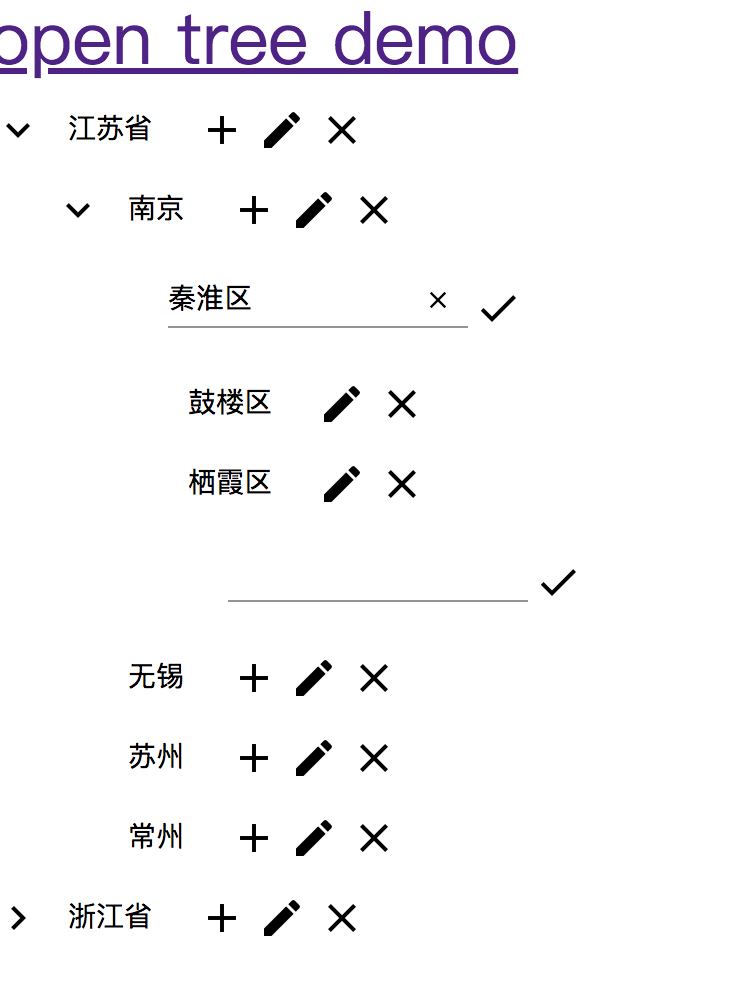

# angular-material-open-tree-example

This project was generated with [Angular CLI](https://github.com/angular/angular-cli) version 6.0.0.
## 效果


## 建立
```bash
ng new angular-material-open-tree-example --routing --style scss --skip-git --skip-install --skip-tests --version 1.0.0
```

## 必须包
```bash
npm install --save @angular/material @angular/cdk @angular/material-moment-adapter  @angular/animations hammerjs 
```

## 运行
```bash
ng serve --port 4200 -o
```
## 打包
```bash
ng build --prod --aot
```
# 其他操作
#### 文档打包
```bash
compodoc -p tsconfig.json  -d docs -s -w
```
#### src/theme/basic.scss转义
>用于html提示
```bash
cd src/theme
scss basic.scss:basic.css -t compressed -C
```
